<!-- https://github.com/skills/communicate-using-markdown -->

-->WISSEN IST MACHT

# Grading Criteria Programmieren T3INF1004
In jedem Unterbereich werden die Punkte (gerne auch Links ins GIT) erklärt, wie das LO erreicht worden ist.
Alle Kriterien betreffen nur die Projektarbeit. Beweismaterial kommt aus dem Gruppenprojekt.

## FACHKOMPETENZ (40 Punkte)

# Die Studierenden kennen die Grundelemente der prozeduralen Programmierung. (10)
<!-- Siehe Kenntnisse in prozeduraler Programmierung: zutreffendes wählen und beweisen-->
# Algorithmus beschreibung
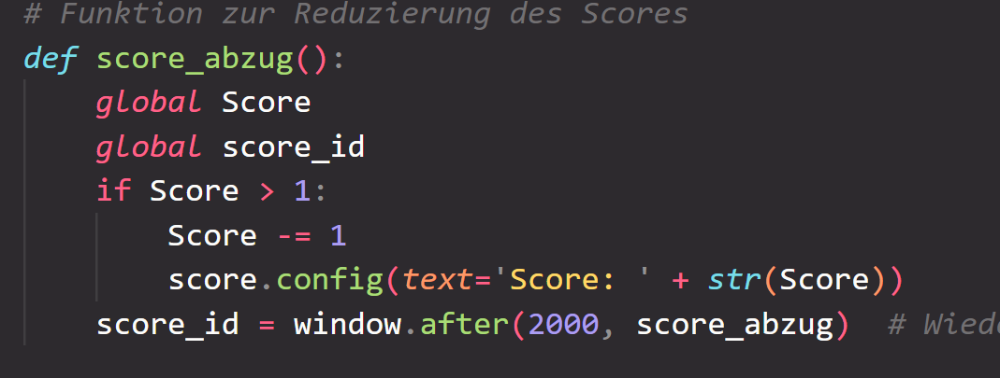
# - Datentypen

# - E/A-Operationen und Dateiverarbeitung
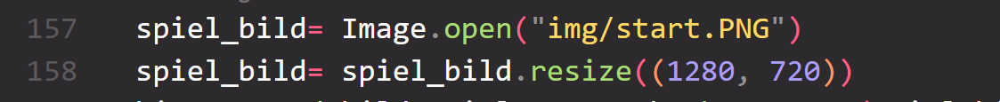
# - Operatoren
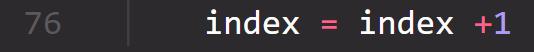
# - Kontrollstrukturen
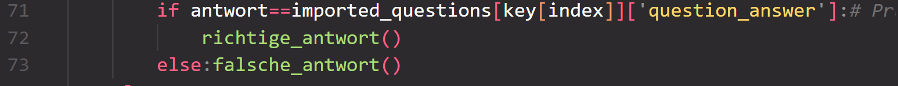
# - Funktionen
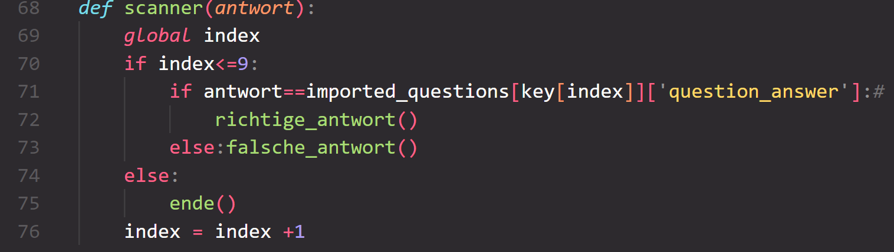
# - Stringverarbeitung
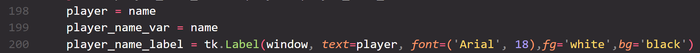
# - Strukturierte Datentypen
![Hier wird auf einen strukturierten Datentyp (wahrscheinlich ein Dictionary) zugegriffen, um die richtige Antwort auf eine Frage zu erhalten. Die Verwendung von Schlüsseln (key[index]) ermöglicht den Zugriff auf bestimmte Einträge im Dictionary.](image-107.png)
# Sie können die Syntax und Semantik von Python (10)
<!-- Eine Stelle aus ihrem Programmieren wählen auf die sie besonders stolz sind und begründen -->
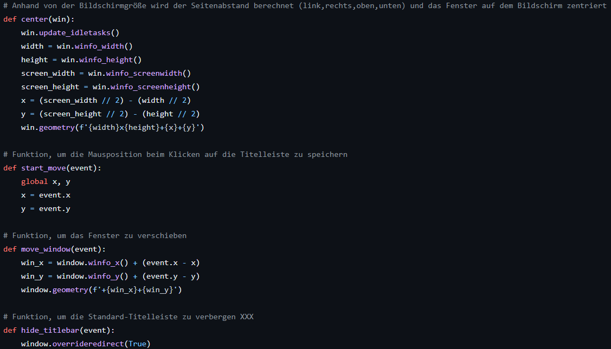
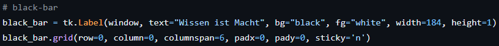
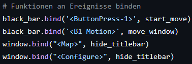
Dass tkinter-Fenster wird immer in der Mitte des Bildschirms erstellt wird, indem die Funktion "center" den Seitenabstand des Bildschirms berechnet. Mit der Funktion "start_move" wird die Mausposition auf der "black_bar" gespeichert und sichergestellt, dass das Fenster von dieser Mausposition aus mit der Funktion "move_window" verschoben wird. Dann werden die verscheidenen Funktionen an die Ereignisse gebunden. Die Blackbar wird mit der Funktion "start_move" und der Funktion "move_window verbunden, um das Fenster durch gedrückhalten der Maustaste auf einem Punkt der Blackbar von dort aus verschieben zu können. Dann wird das Fenster noch mit der Funktion hide_titelbar verbunden um die Standart-Titelleiste dieses tkinter-Fensters zu entfernen. 
Dadurch haben wir gelernt, wie man Funktionen an bestimmt Ereignisse binden kann und wie man einen eigene individuelle Titelleiste erstellen kann. Außerdem haben wir gelernt wie man anhand der Bildschirmgröße berechenen kann, dass das geöffnete Fenster mittig auf dem Bildschirm erscheint.
	

# Sie können ein größeres Programm selbständig entwerfen, programmieren und auf Funktionsfähigkeit testen (Das Projekt im Team) (10)
<!-- Anhand von commits zeigen, wie jeder im Projekt einen Beitrag geleistet hat -->
https://github.com/emmanuelyoussefyoussef/Wissen-ist-Macht/graphs/commit-activity
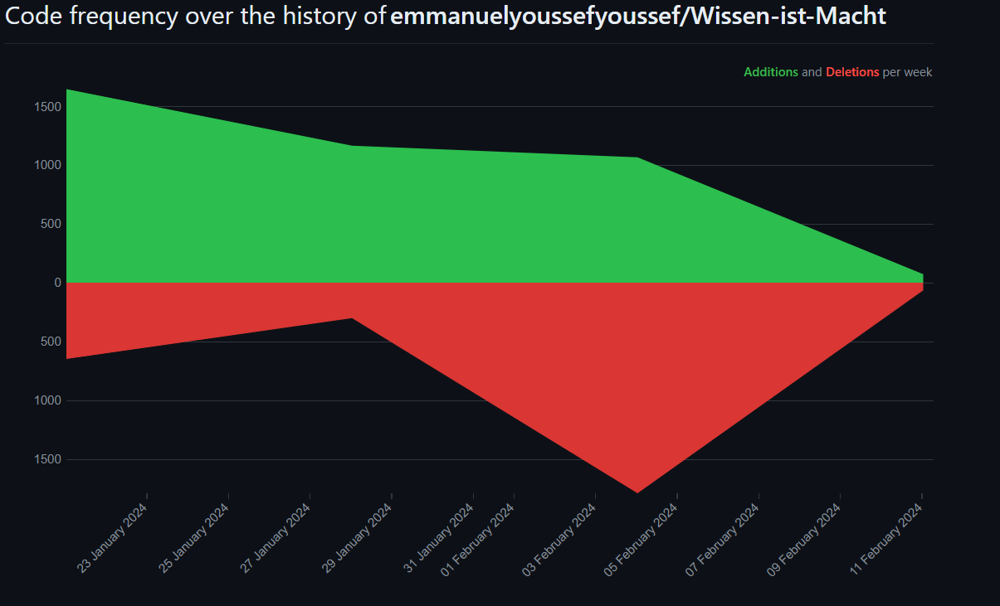

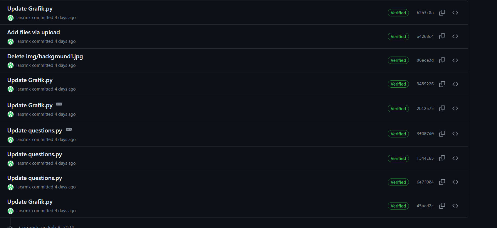
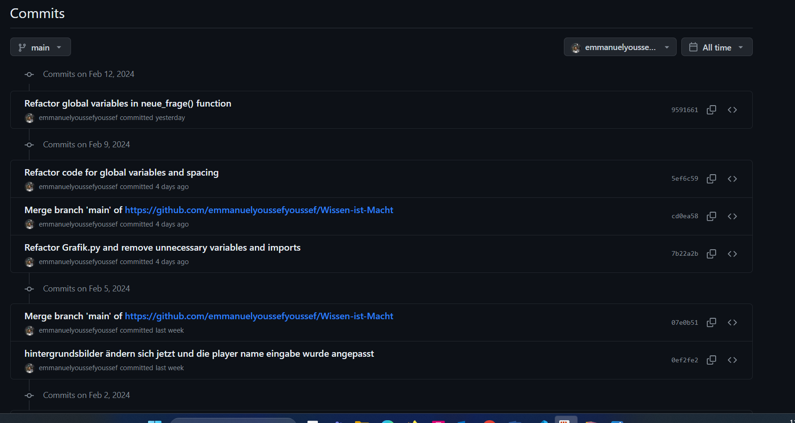
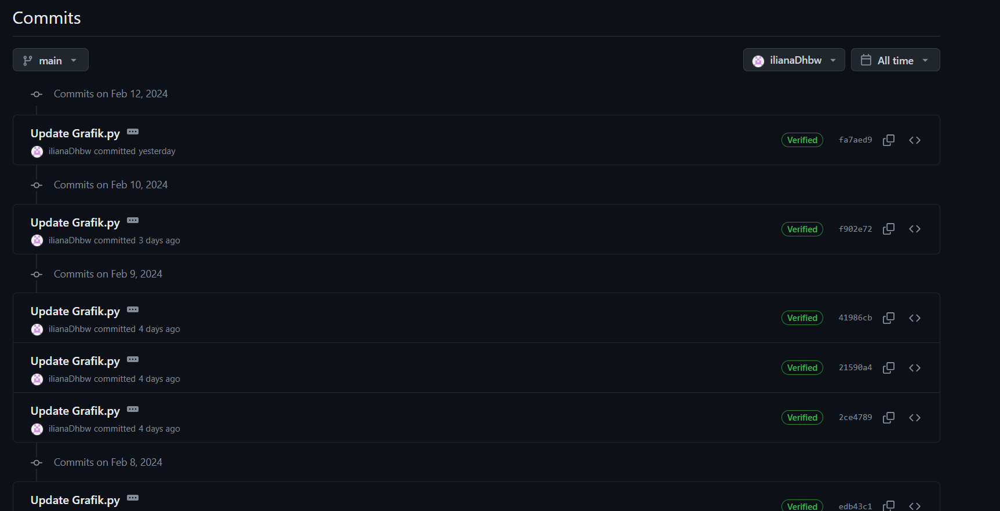
# Sie kennen verschiedene Datenstrukturen und können diese exemplarisch anwenden. (10)
<!-- Eine Stelle aus dem Projekt wählen auf die sie besonders stolz sind und begründen -->

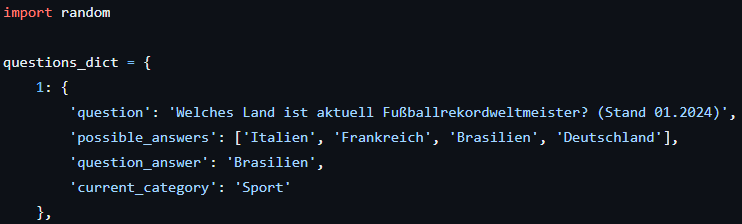
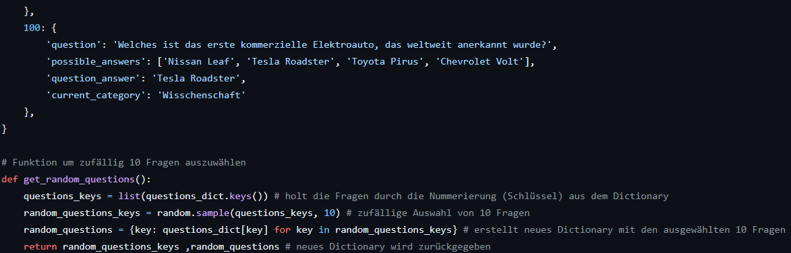
Um unser Quiz mit Fragen zu versorgen haben wir eine Dictionary erstellt. Aus dieser Dictionary werden bei jedem Spielstart 10 Fragen zufällig ausgesucht und
durch die nummerierung (eindeutige keys) in einer neuen dictionary gespeichert. Diese wird dann an die Hauptdatei übergeben, in der dann die Frage, die 
Antwortmöglichkeiten und evtl. auch die Kategorie einer Frage verwendet werden können.

## METHODENKOMPETENZ (10 Punkte)

# Die Studierenden können eine Entwicklungsumgebung verwenden um Programme zu erstellen (10)
<!-- Beweise anbringen für Nutzen folgender Tools (können links, screenshots und screnncasts sein) -->
<!-- VSC -->
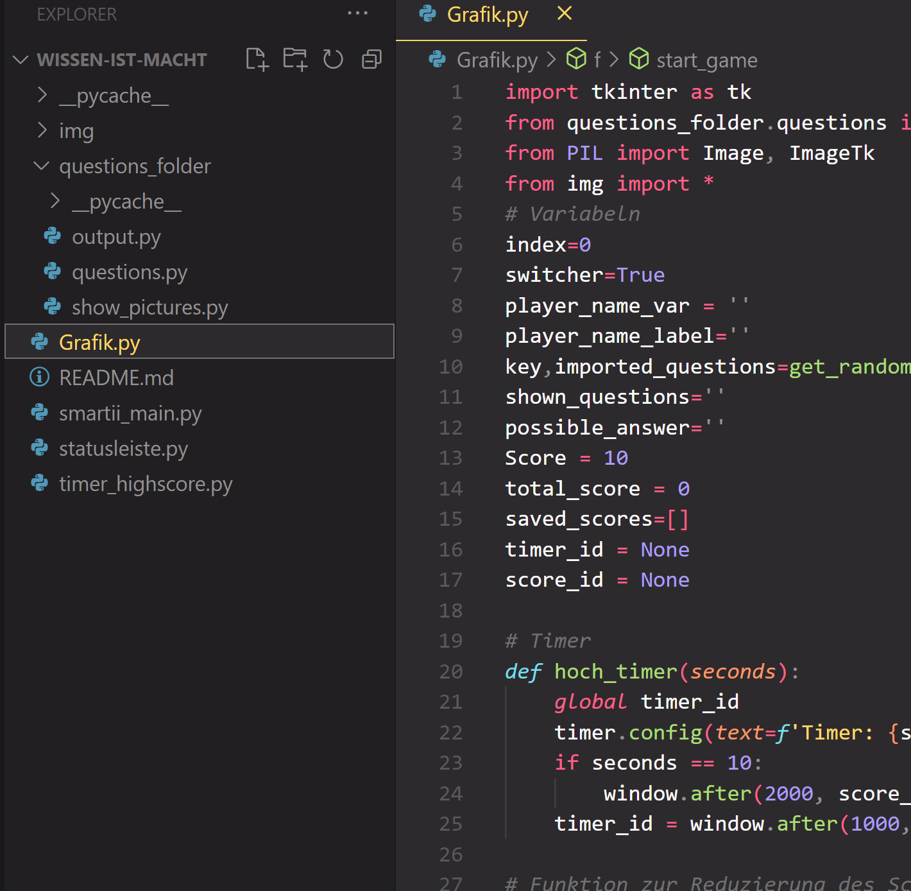

<!-- zB -->
<!-- GIT -->
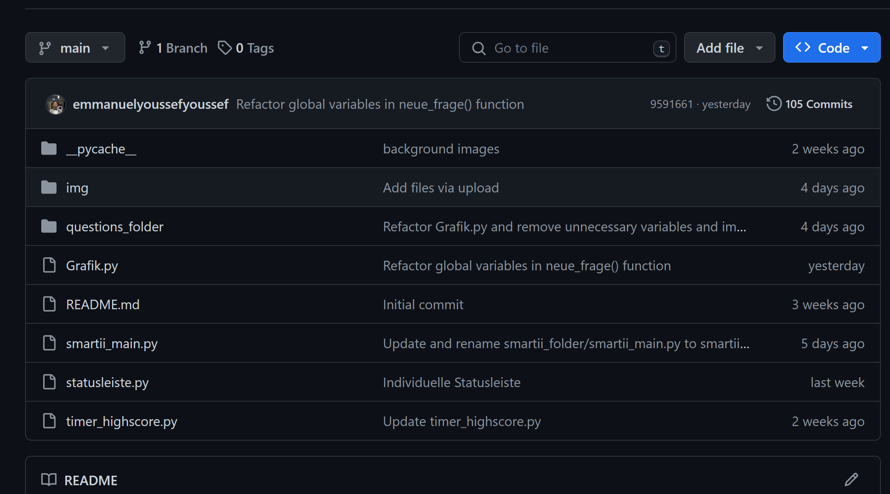
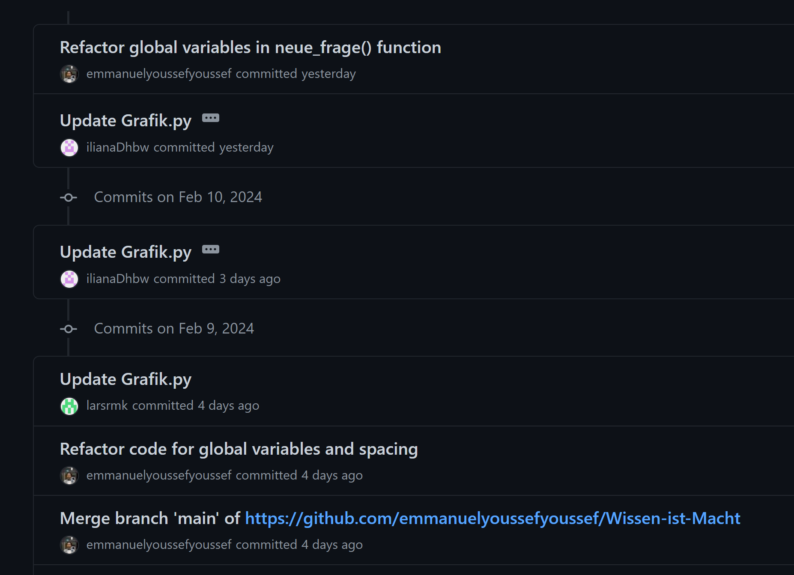
<!-- Copilot -->

<!-- other -->
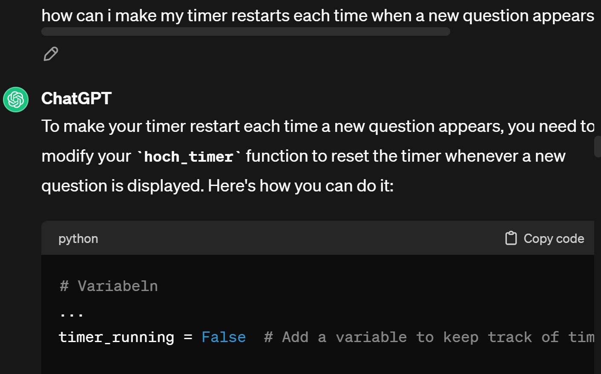

## PERSONALE UND SOZIALE KOMPETENZ (20 Punkte)

# Die Studierenden können ihre Software erläutern und begründen. (5)
<!-- Jeder in der Gruppe: You have helped someone else and taught something to a fellow student (get a support message from one person) -->
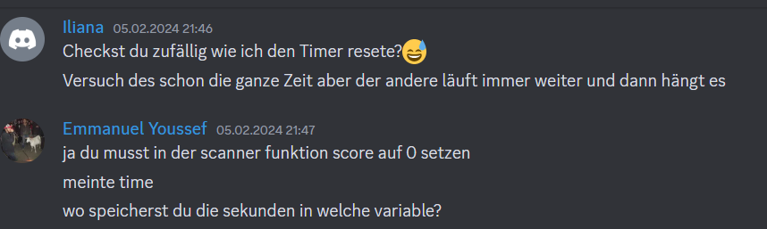
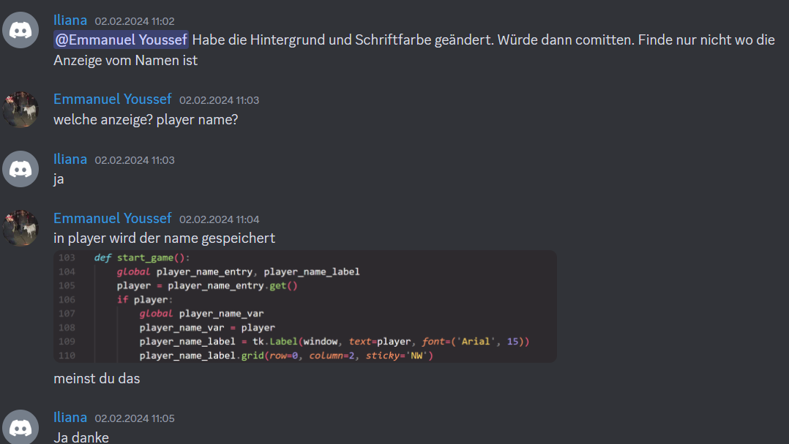
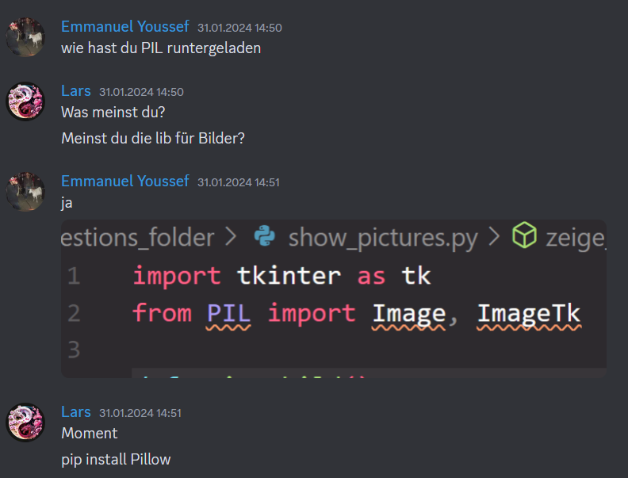
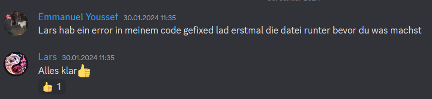
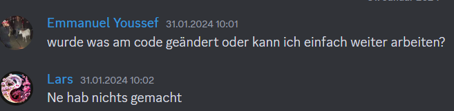

# Sie können existierenden Code analysieren und beurteilen. (5)
<!-- Pro Gruppe:You have critiqued another group project. Link to your critique here (another wiki page on your git) and link the project in the critique, use these evaluation criteria to critique the other project. Make sure they get a top grade after making the suggested changes -->
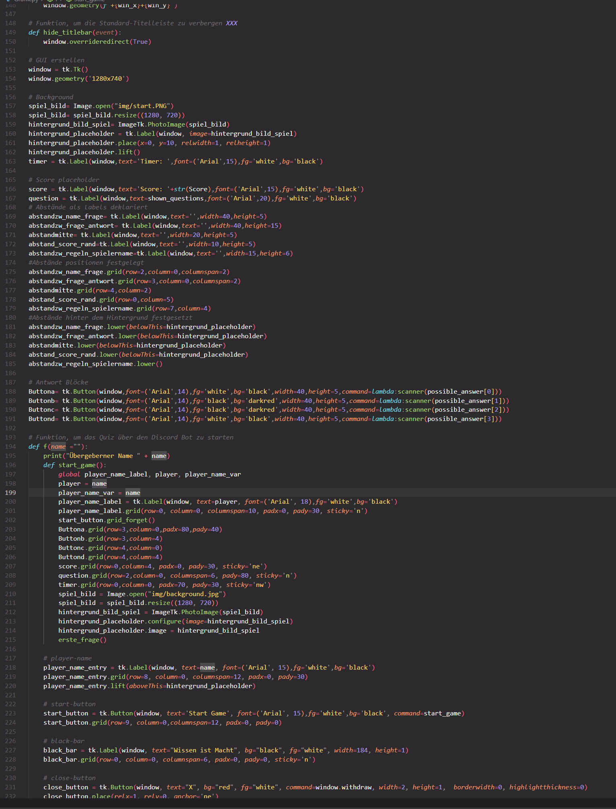
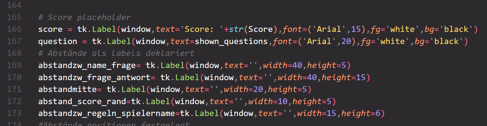
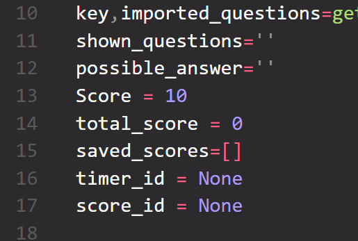
# Sie können sich selbstständig in Entwicklungsumgebungen und Technologien einarbeiten und diese zur Programmierung und Fehlerbehebung einsetzen. (10)
<!-- Which technology did you learn outside of the teacher given input -->
verschiedene libaries:
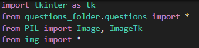
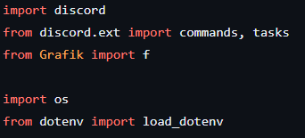
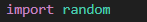

<!-- Did you or your group get help from someone in the classroom (get a support message here from the person who helped you) -->

## ÜBERGREIFENDE HANDLUNGSKOMPETENZ (30 Punkte)

# Die Studierenden können eigenständig Problemstellungen der Praxis analysieren und zu deren Lösung Programme entwerfen (30)
<!-- Which parts of your project are you proud of and why (describe, analyse, link) -->
<!-- Where were the problems with your implementation, timeline, functionality, team management (describe, analyse, reflect from past to future, link if relevant) -->

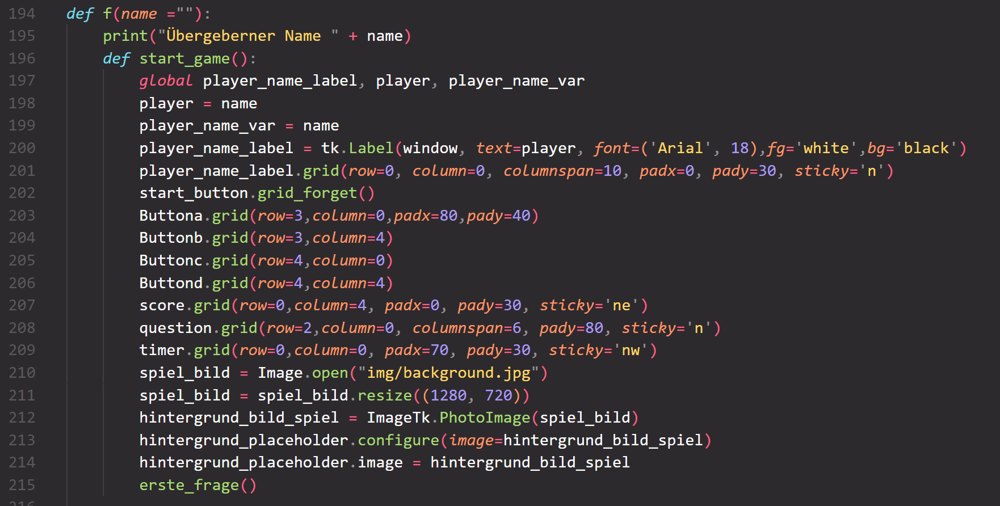

## Kenntnisse in prozeduraler Programmierung:
^^siehe oben Frage 1
# - Algorithmenbeschreibung

# - Datentypen

# - E/A-Operationen und Dateiverarbeitung

# - Operatoren

# - Kontrollstrukturen

# - Funktionen

# - Stringverarbeitung

# - Strukturierte Datentypen

